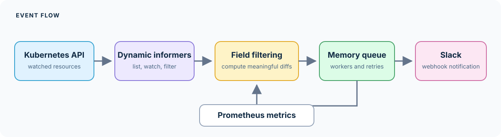

# k8s-diff-informer

Watch selected Kubernetes resources, compare their state, and send Slack notifications when resources are added, changed, or deleted.

> **Release status:** The Helm chart currently defaults to <code>ghcr.io/mina-maher/k8s-diff-informer:1.0.0</code>, but that stable image has not been published. The GitHub Container Registry package shown for this project is private and currently provides a <code>beta</code> tag. To try the code in this repository, build it and publish it to a registry your cluster can access, then override the chart's image settings as shown below.

[Project website](https://mina-maher.github.io/k8s-diff-informer/) · [Website source](site/index.md) · [Installation](deployment/helm/README.md) · [Monitoring](docs/MONITORING.md) · [MIT License](LICENSE)

## What it does

- Watches Kubernetes resource types you choose.
- Computes updates after removing configured fields, so routine metadata changes can be ignored.
- Filters Slack notifications for namespaced resources by namespace.
- Buffers notifications in an in-memory worker queue and retries failed Slack deliveries.
- Exposes Prometheus metrics, health checks, and readiness checks over HTTP.

The first informer sync populates the cache; those initial objects do not produce “added” notifications. Later adds and deletes produce notifications, while updates notify only when the computed diff is non-empty.

## Slack notification example

A deployment image change produces a message like this:

> **Resource Updated — Deployment <code>payments</code>, namespace <code>production</code>**
> Cluster: <code>prod-eu</code>
>
> <code>- image: payments:v4</code>
> <code>+ image: payments:v5</code>

The actual Slack message uses an attachment title, diff text, and cluster footer.

## Quick start with Helm

You need Helm 3, <code>kubectl</code>, access to a Kubernetes cluster, permission to create the chart's ClusterRole and ClusterRoleBinding, an image the cluster can pull, and a Slack webhook.

Create a namespace and a Kubernetes Secret from a protected local file containing the webhook URL:

~~~sh
kubectl create namespace monitoring
kubectl create secret generic informer-slack -n monitoring \
  --from-file=webhook-url=/secure/path/slack-webhook
~~~

Install from this repository:

~~~sh
helm upgrade --install diff-monitor ./deployment/helm \
  --namespace monitoring \
  --set slack.existingSecret=informer-slack \
  --set config.clusterName=my-cluster \
  --set image.repository=YOUR_REGISTRY/k8s-diff-informer \
  --set image.tag=YOUR_TAG \
  --wait --timeout 5m
~~~

Build the image from the checked-out source and push it to a registry your cluster can access before installing:

~~~sh
docker build -t YOUR_REGISTRY/k8s-diff-informer:YOUR_TAG .
docker push YOUR_REGISTRY/k8s-diff-informer:YOUR_TAG
~~~

The GHCR <code>beta</code> package is private, so it requires a registry pull secret. Pass the secret through the chart's <code>imagePullSecrets</code> value. The stable <code>1.0.0</code> image will become the default installation image once it has been published and made accessible.

Set exactly one of <code>slack.existingSecret</code> and <code>slack.webhookUrl</code>. The referenced Secret must exist in the release namespace, and its selected key must contain a non-empty HTTP(S) webhook URL. A chart-created Secret from <code>slack.webhookUrl</code> is stored in Helm release data; prefer an externally managed Secret for production.

See the [Helm installation guide](deployment/helm/README.md) for RBAC customization, configuration, monitoring, and troubleshooting.

## Local development

Requires Go 1.23 or newer as declared in <code>go.mod</code>, plus access to a Kubernetes cluster and a Slack webhook.

~~~sh
export SLACK_WEBHOOK_URL='https://YOUR_WEBHOOK_HOST/YOUR_WEBHOOK_PATH'
go run ./cmd/k8s-diff-informer --kubeconfig "$HOME/.kube/config"
~~~

The program uses <code>~/.kube/config</code> by default outside a cluster. Pass <code>--kubeconfig /path/to/config</code> to select another file. An explicitly empty value selects in-cluster credentials. In a pod, the application detects the service-account credential directory and uses in-cluster configuration.

Run tests and build the application with:

~~~sh
go test ./...
make build
~~~

The Helm chart has offline checks that need Helm 3:

~~~sh
python3 -B -m unittest discover -s test/helm
helm lint --strict ./deployment/helm --set slack.existingSecret=example
~~~

The full Go suite currently has a known failing assertion in <code>test/integration/real_world_scenarios_test.go</code>, <code>TestConfigMapUpdates</code>: its expected <code>port</code> text is absent from the computed diff. This does not require a live Kubernetes cluster.

## Configuration

The application reads these environment variables. The Helm chart exposes the related values under <code>config</code>, <code>queue</code>, <code>metrics</code>, and <code>slack</code>.

| Variable | Default | Purpose |
| --- | --- | --- |
| <code>SLACK_WEBHOOK_URL</code> | Required | Slack webhook URL. Must be a valid HTTP(S) URL. |
| <code>CLUSTER_NAME</code> | <code>kubernetes-cluster</code> | Name included in notifications and metric labels. |
| <code>WATCHED_RESOURCE_NAMES</code> | <code>pods</code> | Comma-separated Kubernetes resource names, such as <code>pods,deployments,services</code>. |
| <code>WATCHED_NAMESPACES</code> | <code>default</code> | Comma-separated notification filter for namespaced resources. |
| <code>RESOURCES_IGNORED_FIELDS</code> | <code>data.status,status,metadata.creationTimestamp,metadata.uid,metadata.resourceVersion,metadata.selfLink,metadata.managedFields,metadata.generation,metadata.finalizers,metadata.annotations,metadata.ownerReferences</code> | Comma-separated object paths removed before comparing resources. |
| <code>QUEUE_ENABLED</code> | <code>true</code> | Must remain enabled; synchronous delivery is not implemented. |
| <code>QUEUE_WORKERS</code> | <code>10</code> | Number of Slack delivery workers; must be positive. |
| <code>QUEUE_SIZE</code> | <code>1000</code> | Maximum buffered tasks; must be positive. |
| <code>METRICS_PORT</code> | <code>8080</code> | HTTP port for metrics, health, and readiness endpoints. |

The Helm chart's watched-resource and namespace defaults differ from the local application defaults. See its [values file](deployment/helm/values.yaml) when deploying with Helm.

## Health and monitoring

The HTTP server exposes:

- <code>/metrics</code> for Prometheus.
- <code>/health</code> and <code>/healthz</code> for process health.
- <code>/ready</code> and <code>/readyz</code> for readiness. These return HTTP 503 until all watched informer caches have synchronized, then HTTP 200. Readiness does not check Slack delivery or guarantee ongoing Kubernetes API connectivity.

The Helm chart creates a metrics Service by default. ServiceMonitor and PrometheusRule resources are disabled by default; enable them only when the Prometheus Operator CRDs are installed. See [monitoring documentation](docs/MONITORING.md).

## Important behavior and limitations

- Run exactly one replica. Each process watches the same resources independently and can send duplicate notifications. The chart uses a <code>Recreate</code> update strategy to avoid overlapping old and new pods; upgrades can cause a short interruption.
- The queue is in memory. Pending notifications can be lost when the process stops. Failed Slack deliveries are retried, but the queue is not durable.
- Namespace settings filter notifications after cluster-wide list and watch requests. They are not a Kubernetes authorization boundary.
- The default ClusterRole grants read-only access to the chart's default watched resource types and API discovery. Add matching <code>rbac.rules</code> when watching other resource types.
- Resource diffs can include sensitive values from watched objects. Select watched resources carefully and configure ignored fields; notifications are sent to the configured Slack destination.
- Initial informer synchronization does not generate add notifications.

## Help and contributions

- [Open an issue](https://github.com/MIna-Maher/k8s-diff-informer/issues) for bugs or feature requests.
- Contribution instructions, community standards, and a private security reporting channel are planned; see the [release roadmap](docs/ROADMAP.md).
- Review the [open source release roadmap](docs/ROADMAP.md).

## License

This project is licensed under the [MIT License](LICENSE).

## Project website

The documentation site is built from <code>site/</code> and deployed by GitHub Actions. To publish it, enable GitHub Pages in repository settings and select <code>GitHub Actions</code> as the build and deployment source. The site address is <https://mina-maher.github.io/k8s-diff-informer/>. GitHub Pages availability for private repositories depends on the account or organization plan; the repository visibility has not been changed.
